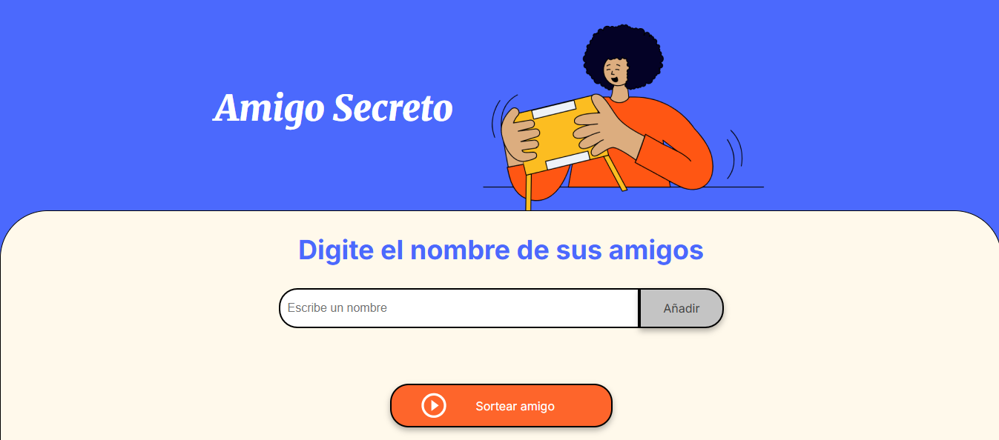
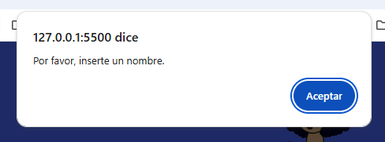
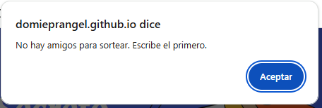
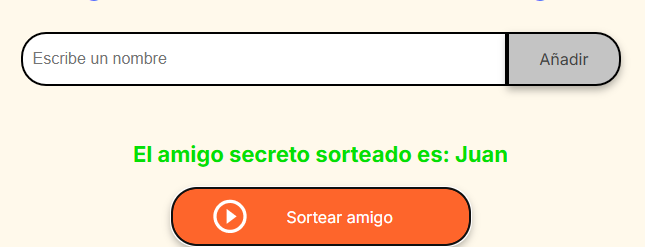

<h1 align="center">Challenge - Amigo Secreto 🎁</h1>

## Descripción

Aplicación web en JavaScript que permite gestionar una lista de amigos y realizar el sorteo automático de un “amigo secreto”. Incluye validaciones, manejo dinámico de la lista y una interfaz sencilla para demostrar la funcionalidad.

---

## Demostración

  

---

## Cómo usar la app paso a paso

1. **Agregar participantes**  
   - Escribe el nombre de un amigo en el campo de texto.  
   - Presiona el botón **Agregar**.  
   - Si el campo está vacío, la app mostrará un mensaje de alerta:
     
     

       
     

   - La lista de participantes se actualizará automáticamente debajo del input:

     

       
     

2. **Realizar el sorteo del amigo secreto**  
   - Haz clic en el botón **Sorteo** o **Seleccionar amigo secreto**.  
   - La app elegirá un nombre al azar de la lista de participantes.  
   - Si la lista de amigos está vacía, la app mostrará mensaje de alerta:

     

       
     

   - El resultado se mostrará en pantalla para que todos puedan ver quién es el amigo secreto:

     

       
     

---

## Tecnologías usadas

- HTML5
- CSS3
- JavaScript (DOM, arrays y funciones)

---

## Mejoras por implementar

- Evitar duplicados en la lista de participantes.  
- Agregar botón de reinicio sin recargar la página.  

---

## Estado del proyecto

- Proyecto funcional ✅  
- Algunas mejoras pendientes como se indica arriba.

---

